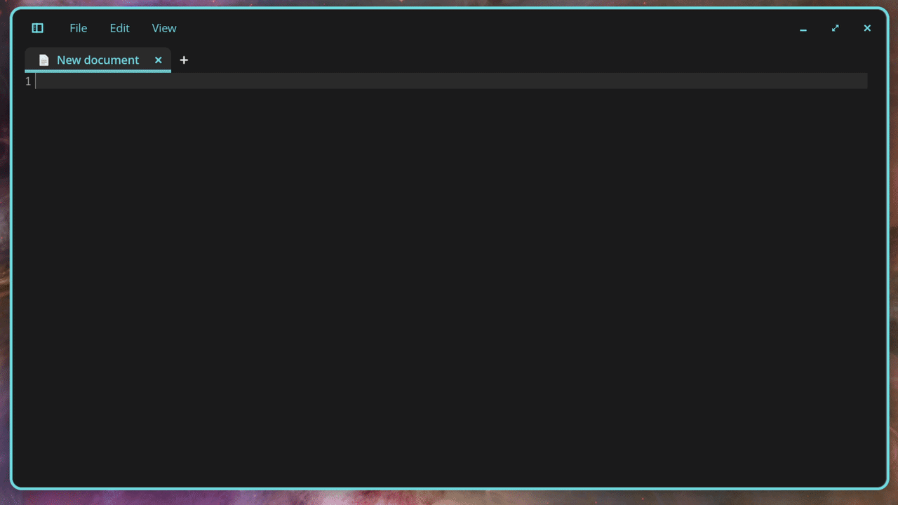

<div align="center">

# ◈ VERBATIM

### Local AI voice dictation for Linux.

**Click a text field · Press Super+V · Speak · Pause**

<br>


<br><br>

**Speak naturally. Verbatim transcribes on your computer and pastes your words into the app you're using.**

Use it in browsers, chat apps, editors, and VR. It runs in the background, with automatic WiVRn audio switching and four appearance options—including real frosted glass.

[Install / update](#install-update) · [Desktop demo](#desktop-demo) · [VR demos](#vr-demos) · [Uninstall](#uninstall) · [Technical documentation](#technical-documentation)

</div>

---

<a id="install-update"></a>

## ⚡ Install or update

Run this command in a terminal:

```bash
curl -fsSL https://raw.githubusercontent.com/MagnetosphereLabs/Verbatim/main/install.sh | bash
```

**Already installed? Run the same command again to update.** The installer downloads the complete current version from GitHub, preserves your saved preferences and downloaded models, and restarts Verbatim.

Run it as your normal desktop user, **without `sudo` in front of the command**. The installer asks for your password when it needs system packages or device permissions. On a successful installation, **no reboot or logout is required**.

First-time setup offers three transcription profiles: **Speed**, **Balanced** (default), and **Quality**. Installing dependencies, downloading a model, or building a GPU backend can take a while; subsequent dictation runs locally.

> [!TIP]
> Updating does not require uninstalling first. Uninstalling removes your local application data, including models and settings.

### Start dictating

1. Click the text field where you want your words to appear.
2. Press **Super+V**—the Super key is usually the Windows-logo key—and speak.
3. Pause when you're finished. Verbatim completes transcription and pastes the result.

Keep the intended app focused until delivery. Press **Super+V** again to cancel an active dictation; typing on the keyboard also cancels it. Open the overlay's settings to choose a microphone, transcription profile, realtime preview, or appearance.

If the installer reports a shortcut conflict, assign a free shortcut in your desktop's keyboard settings to:

```bash
"$HOME/.local/bin/kdictate" toggle
```

<a id="uninstall"></a>

### ✕ Uninstall

```bash
curl -fsSL https://raw.githubusercontent.com/MagnetosphereLabs/Verbatim/main/uninstall.sh | bash -s -- --purge-system
```

This removes Verbatim's application files, local models and settings, startup entries, shortcuts, and its system input-access configuration. Shared distribution packages installed as dependencies remain installed.

---

<a id="desktop-demo"></a>

## ◇ Dictation on the desktop

**Speak into the text field you're already using.** No separate document or transcription service is needed.

<div align="center">

</div>

---

<a id="vr-demos"></a>

## ◇ Dictation in VR

Verbatim integrates with **WiVRn** and **WayVR** for dictation in VR apps. When your headset connects, it can switch the system microphone and output to WiVRn. When the headset disconnects, it restores the devices you were using before VR.

The audio monitor runs in the background, even when the dictation overlay is closed. You can leave your VR apps running during a desktop break.

<div align="center">


<br><br>


</div>

---

## What you get

| Feature | What it does |
| :--- | :--- |
| **Local transcription** | Runs Whisper on your computer; speech is not sent to a cloud transcription API. |
| **Desktop text delivery** | Uses session-aware clipboard and keyboard backends for X11 and Wayland. |
| **GPU acceleration** | Uses NVIDIA CUDA or a supported hardware Vulkan GPU, with a CPU fallback. |
| **Realtime preview** | Shows provisional text while you speak, then transcribes the full recording for delivery. |
| **VR audio switching** | Confirms headset connection changes, saves your previous devices, and restores them after disconnecting. |
| **Discord voice routing** | Moves recognized Discord and derivative-client voice streams between desktop and VR devices. |
| **Four themes** | Dark, Light, Glass dark, and Glass light. **Glass dark is the default for new installations.** |
| **Transcript recovery** | Keeps the last completed transcript available if automatic paste cannot finish. |

---

<a id="technical-documentation"></a>

## Technical documentation

### Distribution and desktop support

Verbatim chooses its integration from the actual desktop session and available capabilities. The distribution determines package installation; **X11 versus Wayland determines clipboard, keyboard, focus, and blur behavior**.

| Distribution | Package manager | Desktop support and verification |
| :--- | :--- | :--- |
| **Pop!_OS** | APT | Working use confirmed on **COSMIC / Wayland**, including dictation delivery and glass appearance. |
| **Linux Mint** | APT | Working dictation confirmed on **X11**. A Wayland session uses the Wayland backend when available. |
| **Ubuntu** | APT | Installer support; uses the session's X11 or Wayland integration and matching desktop portal. |
| **Fedora** | DNF | Installer support; uses the session's X11 or Wayland integration and matching desktop portal. |
| **Arch / CachyOS** | pacman | Installer support; desktop and compositor capabilities determine the active integration. |

The Ubuntu, Fedora, Arch/CachyOS, and Mint Wayland paths are implemented, but do not have the same confirmed runtime coverage as Pop!_OS COSMIC and Mint X11. Individual apps must accept clipboard paste, and compositor capabilities vary.

**Shortcuts:** registration supports common desktop environments and avoids replacing an unrelated existing shortcut. If Super+V is occupied—such as by a desktop notification panel—the installer reports it and prints the command to bind manually.

### How dictation reaches your app

Audio capture runs separately from transcription. A background inference worker handles the local model, so a failed or stalled inference task can be restarted without making the audio callback depend on it.

With realtime transcription enabled, partial results are previews. After the silence threshold, Verbatim performs a final pass over the complete recording. It saves the finished transcript, publishes and verifies clipboard text, then sends the appropriate paste shortcut.

- **X11:** uses `xclip` or `xsel` for the clipboard and `xdotool` for paste. Focus tracking remembers the target application across brief shell-menu interruptions, including Mint's Super-key menu.
- **Wayland:** uses `wl-copy` / `wl-paste` and a persistent virtual keyboard through Linux `uinput`. Where available, GTK4 layer-shell keeps the overlay from taking keyboard focus; other window backends release focus before delivery.
- **Focus changes:** if you genuinely switch to another app before delivery, automatic paste is withheld and the completed transcript remains recoverable.

New installations enable realtime preview and set its finish threshold to **2.85 seconds of silence**. Final inference and text delivery add processing time after that pause. Updates retain an existing threshold, so timing can differ between installations and hardware.

### Models and acceleration

| Profile | Model | Intended tradeoff |
| :--- | :--- | :--- |
| **Speed** | `base.en` | Lower processing cost and faster transcription. |
| **Balanced** | `small.en` | Default balance of accuracy and resource use. |
| **Quality** | `large-v3` | A larger model with greater processing and memory requirements. |

| Hardware path | Runtime |
| :--- | :--- |
| NVIDIA CUDA | `faster-whisper` with CTranslate2 and CUDA libraries. |
| Supported hardware Vulkan GPU | `whisper.cpp` built with Vulkan support. |
| CPU | CPU inference when usable GPU acceleration is unavailable; native `whisper.cpp` also provides a fallback when the Python runtime cannot be installed. |

Software Vulkan adapters are not treated as GPU acceleration. Actual speed depends on the selected model, recording length, hardware, and runtime availability. The background daemon warms the model to reduce startup cost.

### WiVRn connection confirmation and restoration

Headset state comes from WiVRn's **`HeadsetConnected`** property, rather than the presence of VR processes or lingering audio devices.

| Change | Confirmation before switching |
| :--- | :--- |
| Headset connects | Wait **7 seconds**, then confirm it is still connected. |
| Headset disconnects | Wait **7 seconds**, check again, then wait another **7 seconds** and confirm it is still disconnected. |

A connection reversal cancels the pending transition. Audio routing retries when devices appear late. Before switching to VR, Verbatim journals the previous system input/output and application stream routes so it can restore them, including after an interrupted session. Missing restoration devices are retried rather than replaced with an arbitrary microphone or speaker.

When enabled, EasyEffects is temporarily paused for VR and restored afterward. The installer also attempts WayVR integration when it detects an existing WayVR installation.

#### Discord and derivative clients

Verbatim routes recognized **Discord, Discord Canary/PTB, Vesktop, Legcord, Equicord, and Armcord** voice streams through the audio server. Active voice input/output can therefore follow VR even when the client has an explicit device selection. The monitor also handles voice streams created after the connection change. Screen-sharing capture streams are excluded.

**Routing a voice stream and changing Discord's saved device selections are separate operations.** Normal audio routing does not rewrite the device names shown in Discord's settings. The optional settings adapter requires a Discord-approved application with voice RPC access and an authorized token; it is not configured by a normal installation. Closed clients have no live streams to move; routing applies when their voice streams appear.

### Appearance and real frosted glass

Choose **Dark**, **Light**, **Glass dark**, or **Glass light** under **Settings → Appearance**. Saved choices survive updates.

Glass themes use actual blur:

- **Native compositor blur** when the compositor exposes a supported protocol, including supported COSMIC and KDE configurations.
- **Local Gaussian backdrop blur** when native blur is unavailable. X11 captures the backdrop directly; Wayland uses the desktop's screen-capture portal and may require a screen-sharing permission prompt.

The fallback renders blurred backdrop pixels beneath a readable tinted surface. Gaussian blur is applied only to a small crop around the overlay, and capture pauses between openings. Native blur and a captured backdrop can differ in how they follow moving content. If screen access is unavailable, the interface remains readable and reports that access is needed for the glass backdrop.

### Configuration and installation layout

The default application directory is:

```text
~/.local/share/kdictate-cosmic/
```

The historical `kdictate` name remains in command and service paths for compatibility. Settings live in `config.env` inside that directory; models, recovery data, and logs also stay there. `KDICTATE_APPDIR` can override the application location.

Prefer the overlay's settings for microphone, model profile, preview, and appearance. Advanced configuration includes:

| Key | Purpose |
| :--- | :--- |
| `KDICTATE_THEME` | `dark`, `light`, `glass-dark`, or `glass-light`. |
| `KDICTATE_WIVRN_AUTO_AUDIO` | Enable or disable automatic VR audio routing (`1` / `0`). |
| `KDICTATE_WIVRN_PAUSE_EASYEFFECTS` | Enable or disable EasyEffects pause/restore (`1` / `0`). |
| `KDICTATE_REALTIME_TRANSCRIPTION` | Enable or disable realtime preview (`1` / `0`). |
| `KDICTATE_REALTIME_SILENCE_TO_FINISH_SECONDS` | Silence threshold while realtime preview is enabled. |

Restart the daemon after manually editing configuration:

```bash
"$HOME/.local/bin/kdictate" quit
"$HOME/.local/bin/verbatim-session"
```

The installer uses the distribution's Python with GTK bindings and creates a dedicated virtual environment. A separate Conda environment can remain active in your terminal. Desktop autostart imports the current session environment; the user service is named `kdictate.service`.

### Diagnostics and recovery

<details>
<summary><strong>Check the daemon, audio integration, or GPU backend</strong></summary>

```bash
"$HOME/.local/bin/kdictate" status
"$HOME/.local/bin/kdictate" doctor
"$HOME/.local/bin/kdictate" gpu-status
```

`doctor` reports session backends, input access, and audio integration information. These commands use full paths so they also work when `~/.local/bin` is not on your shell's `PATH`.

</details>

<details>
<summary><strong>Recover text if automatic paste did not finish</strong></summary>

```bash
"$HOME/.local/bin/kdictate" last-transcript
```

If delivery reports a focus change, return to the intended text field and paste the retained text, or retrieve it with the command above. If Super+V opens a desktop panel, check the installer's shortcut message and bind a free shortcut to `kdictate toggle`.

</details>

<details>
<summary><strong>Read installation and runtime logs</strong></summary>

```bash
journalctl --user -u kdictate.service -n 100 --no-pager
tail -n 100 "$HOME/.local/share/kdictate-cosmic/kdictate.log"
tail -n 100 "$HOME/.local/share/kdictate-cosmic/install.log"
```

Use your overridden application directory if you set `KDICTATE_APPDIR`. Installation errors appear in `install.log`; runtime and delivery messages appear in `kdictate.log` and the user-service journal.

</details>
